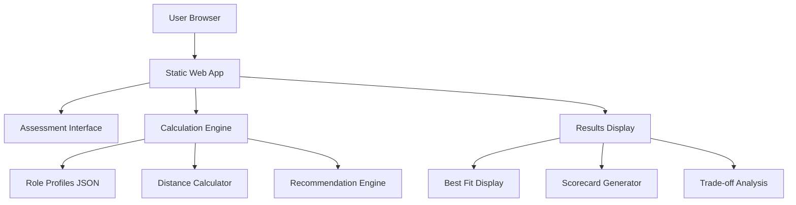
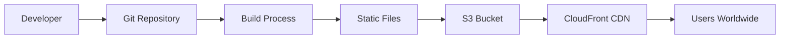

# Design Document: Career Referee for Engineers

## Overview

The Career Referee is a client-side web application that provides objective career guidance for engineering professionals through quantitative role matching. The system uses mathematical distance calculations to match user profiles against predefined engineering role profiles, delivering transparent recommendations with detailed trade-off analysis.

The application follows a simple, efficient architecture optimized for fast decision-making and easy deployment. All computation happens client-side, eliminating server dependencies and ensuring instant results.

## Architecture

### System Architecture



### Deployment Architecture



The application uses a static site architecture for maximum simplicity and performance:
- **Frontend**: Pure HTML/CSS/JavaScript hosted on S3
- **Data**: JSON files served as static assets
- **Computation**: Client-side JavaScript using Euclidean distance algorithm
- **Deployment**: S3 + CloudFront for global distribution

## Components and Interfaces

### Assessment Interface Component

**Purpose**: Collects user input across five evaluation dimensions

**Interface**:
```javascript
class AssessmentInterface {
  collectUserInput(): UserProfile
  validateInput(profile: UserProfile): ValidationResult
  displayErrors(errors: ValidationError[]): void
}

interface UserProfile {
  coding: number        // 1-5 scale
  ops: number          // 1-5 scale  
  stress: number       // 1-5 scale
  salary: number       // 1-5 scale
  worklife: number     // 1-5 scale (5 = wants peace)
}
```

**Responsibilities**:
- Render 5-question assessment form with clear rating scales
- Validate all inputs are integers between 1-5 inclusive
- Prevent submission until all fields are complete
- Provide immediate visual feedback for validation errors

### Distance Calculator Component

**Purpose**: Computes mathematical similarity between user and role profiles

**Interface**:
```javascript
class DistanceCalculator {
  calculateDistance(user: UserProfile, role: RoleProfile): number
  rankRoles(user: UserProfile, roles: RoleProfile[]): RankedRole[]
}

interface RankedRole {
  name: string
  profile: RoleProfile
  distance: number
  matchPercentage: number
}
```

**Algorithm**: Uses Euclidean distance formula optimized for 5-dimensional space:
```
distance = √[(u₁-r₁)² + (u₂-r₂)² + (u₃-r₃)² + (u₄-r₄)² + (u₅-r₅)²]
```

Where u = user scores, r = role scores for each dimension.

**Performance Requirements**:
- Calculate distances for all 4 roles in <10ms
- Return deterministic results for identical inputs
- Handle edge cases (perfect matches, maximum distances)

### Role Profile Manager Component

**Purpose**: Manages engineering role definitions and scoring

**Interface**:
```javascript
class RoleProfileManager {
  loadRoles(): Promise<RoleProfile[]>
  getRoleByName(name: string): RoleProfile
  validateRoleProfile(profile: RoleProfile): boolean
}

interface RoleProfile {
  name: string
  coding: number      // Technical implementation skill
  ops: number        // Operations/infrastructure experience  
  stress: number     // Stress tolerance requirement
  salary: number     // Compensation ceiling potential
  worklife: number   // Work-life balance expectation
}
```

**Role Definitions** (based on industry analysis):
- **SRE**: {coding: 4, ops: 5, stress: 5, salary: 5, worklife: 1}
- **DevOps**: {coding: 3, ops: 4, stress: 4, salary: 4, worklife: 2}  
- **Platform Engineer**: {coding: 5, ops: 3, stress: 3, salary: 5, worklife: 4}
- **Cloud Engineer**: {coding: 3, ops: 2, stress: 2, salary: 3, worklife: 5}

### Recommendation Engine Component

**Purpose**: Generates comprehensive analysis and recommendations

**Interface**:
```javascript
class RecommendationEngine {
  generateScorecard(user: UserProfile, rankings: RankedRole[]): Scorecard
  analyzeTradeoffs(user: UserProfile, role: RoleProfile): TradeoffAnalysis
  suggestGrowthPath(user: UserProfile, targetRole: RoleProfile): GrowthPath
}

interface Scorecard {
  bestFit: RankedRole
  allMatches: RankedRole[]
  tradeoffs: TradeoffAnalysis[]
  growthPaths: GrowthPath[]
  riskProfiles: RiskProfile[]
}
```

### Results Display Component

**Purpose**: Presents analysis in clear, actionable format

**Interface**:
```javascript
class ResultsDisplay {
  displayBestFit(role: RankedRole): void
  renderScorecard(scorecard: Scorecard): void
  showTradeoffAnalysis(tradeoffs: TradeoffAnalysis[]): void
  highlightGrowthOpportunities(paths: GrowthPath[]): void
}
```

## Data Models

### Core Data Structures

```javascript
// User assessment input
interface UserProfile {
  coding: number        // 1-5: Programming/technical skills
  ops: number          // 1-5: Operations/infrastructure experience
  stress: number       // 1-5: Ability to handle high-pressure situations  
  salary: number       // 1-5: Compensation ambition level
  worklife: number     // 1-5: Work-life balance preference (5 = prioritize balance)
}

// Engineering role definition
interface RoleProfile {
  name: string         // Role title
  coding: number       // Required technical skill level
  ops: number         // Required operations experience
  stress: number      // Typical stress level of role
  salary: number      // Compensation ceiling potential
  worklife: number    // Expected work-life balance
  description: string // Role summary
  risks: string[]     // Common risks (burnout, layoffs, etc.)
}

// Analysis results
interface TradeoffAnalysis {
  role: string
  gains: string[]      // What user gains choosing this role
  losses: string[]     // What user sacrifices choosing this role
  conflicts: DimensionConflict[]
}

interface DimensionConflict {
  dimension: string
  userScore: number
  roleScore: number
  impact: string       // Description of the mismatch impact
}

interface GrowthPath {
  role: string
  currentGap: number   // Distance to target role
  recommendations: SkillRecommendation[]
}

interface SkillRecommendation {
  dimension: string
  currentLevel: number
  targetLevel: number
  actionItems: string[]
}
```

### Data Storage Format

Role profiles stored in `data/roles.json`:
```json
{
  "roles": [
    {
      "name": "SRE",
      "coding": 4,
      "ops": 5, 
      "stress": 5,
      "salary": 5,
      "worklife": 1,
      "description": "Site Reliability Engineer - Ensures system uptime and performance",
      "risks": ["High burnout potential", "On-call stress", "Blame culture exposure"]
    }
  ]
}
```

## Correctness Properties

*A property is a characteristic or behavior that should hold true across all valid executions of a system—essentially, a formal statement about what the system should do. Properties serve as the bridge between human-readable specifications and machine-verifiable correctness guarantees.*

### Property 1: Input Validation Consistency
*For any* user input or role profile data, validation should accept all values between 1 and 5 inclusive and reject all values outside this range with descriptive error messages.
**Validates: Requirements 1.2, 2.3, 8.1**

### Property 2: Form Completion Logic
*For any* assessment form state, submission should be enabled if and only if all required fields contain valid values.
**Validates: Requirements 1.3, 1.4, 8.4**

### Property 3: Data Structure Integrity
*For any* role profile accessed by the system, it should contain all five required dimensions (coding, ops, stress, salary, worklife) with valid numeric values.
**Validates: Requirements 2.2, 7.5**

### Property 4: Distance Calculation Accuracy
*For any* user profile and role profile, the Euclidean distance calculation should produce mathematically correct results using the formula: √[(u₁-r₁)² + (u₂-r₂)² + (u₃-r₃)² + (u₄-r₄)² + (u₅-r₅)²].
**Validates: Requirements 3.1**

### Property 5: Role Ranking Correctness
*For any* set of role profiles and user profile, roles should be ranked in ascending order of distance from the user profile (closest match first).
**Validates: Requirements 3.2**

### Property 6: Calculation Determinism
*For any* identical user and role profile inputs, the distance calculation should always produce identical results.
**Validates: Requirements 3.5**

### Property 7: Comprehensive Results Display
*For any* completed evaluation, the results should display the best-fit role, match percentages for all roles, trade-off analysis, growth paths, and risk profiles.
**Validates: Requirements 4.1, 4.2, 4.3, 4.4, 4.5**

### Property 8: Transparent Reasoning Display
*For any* role recommendation, the system should display mathematical distance scores, dimension alignment analysis, and quantified trade-offs with specific examples.
**Validates: Requirements 5.1, 5.2, 5.3, 5.4, 5.5**

### Property 9: Data Persistence Reliability
*For any* role profile modification, changes should be validated before saving and persist immediately upon successful validation.
**Validates: Requirements 2.4, 7.4**

### Property 10: Error Recovery Behavior
*For any* error condition (network, calculation, or validation), the system should handle it gracefully, provide user-friendly messages, and automatically clear errors when resolved.
**Validates: Requirements 2.5, 7.3, 8.2, 8.3, 8.5**

### Property 11: Cross-Platform Compatibility
*For any* supported browser or screen size, the interface should maintain usability and provide appropriate visual feedback for user interactions.
**Validates: Requirements 6.2, 6.3**

### Property 12: Data Loading Reliability
*For any* application startup, role profiles should be successfully loaded from storage with fallback handling for failures.
**Validates: Requirements 7.1, 7.3**

## Error Handling

### Input Validation Errors
- **Invalid Scores**: Display specific messages for out-of-range values (e.g., "Score must be between 1 and 5")
- **Missing Fields**: Highlight incomplete fields and prevent form submission
- **Data Type Errors**: Handle non-numeric inputs gracefully with clear feedback

### Calculation Errors
- **Division by Zero**: Handle edge cases in percentage calculations
- **Invalid Profiles**: Validate role profile completeness before calculations
- **Memory Constraints**: Optimize calculations for client-side performance

### Network and Storage Errors
- **Failed Data Loading**: Provide fallback role profiles embedded in application
- **Storage Unavailable**: Gracefully degrade to read-only mode
- **Timeout Handling**: Implement reasonable timeouts with user feedback

### Recovery Mechanisms
- **Automatic Error Clearing**: Remove error messages when user corrects input
- **Retry Logic**: Attempt failed operations with exponential backoff
- **Graceful Degradation**: Maintain core functionality even when optional features fail

## Testing Strategy

### Dual Testing Approach

The Career Referee will use both unit testing and property-based testing to ensure comprehensive correctness validation:

**Unit Tests** focus on:
- Specific examples demonstrating correct behavior
- Edge cases (perfect matches, maximum distances, boundary values)
- Integration points between components
- Browser compatibility verification
- Error condition handling

**Property-Based Tests** focus on:
- Universal properties that hold across all valid inputs
- Mathematical correctness of distance calculations
- Input validation across the entire valid range
- UI behavior consistency across different data sets
- Data integrity maintenance under all operations

### Property-Based Testing Configuration

- **Testing Library**: Use fast-check for JavaScript property-based testing
- **Test Iterations**: Minimum 100 iterations per property test
- **Test Tagging**: Each property test tagged with format: **Feature: career-referee, Property {number}: {property_text}**
- **Coverage**: Each correctness property implemented as a single property-based test

### Testing Implementation Requirements

**Property Test Examples**:
- Generate random user profiles and verify distance calculations are mathematically correct
- Generate various form states and verify submission logic consistency
- Generate role profile variations and verify data structure integrity
- Generate error conditions and verify graceful handling

**Unit Test Examples**:
- Test specific role matching scenarios (SRE vs Platform Engineer for high-stress user)
- Test browser compatibility across Chrome, Firefox, Safari, Edge
- Test responsive design at specific breakpoints (mobile, tablet, desktop)
- Test error recovery for specific failure scenarios

### Test Data Strategy

**Smart Generators**:
- Constrain user profiles to valid 1-5 range for realistic testing
- Generate role profiles with realistic engineering role characteristics
- Create edge cases (all 1s, all 5s, mixed extremes) for boundary testing
- Simulate realistic error conditions (network timeouts, malformed data)

**Validation Approach**:
- Mathematical properties verified against known correct implementations
- UI properties verified through DOM inspection and interaction simulation
- Error handling verified through controlled failure injection
- Performance properties measured with appropriate tolerances

Before writing correctness properties, I need to analyze the acceptance criteria for testability:

<function_calls>
<invoke name="prework">
<parameter name="featureName">career-referee